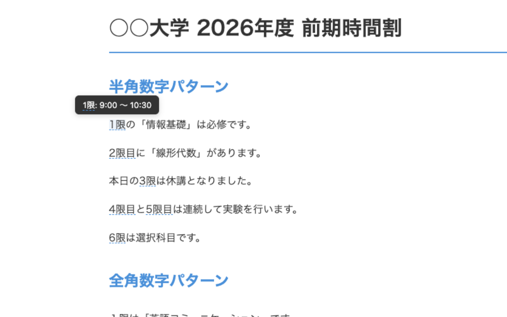
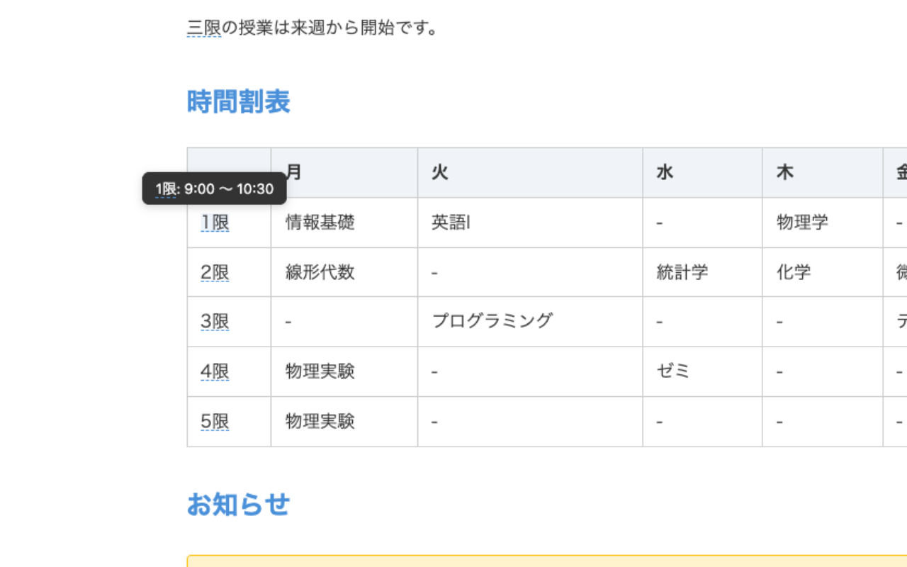
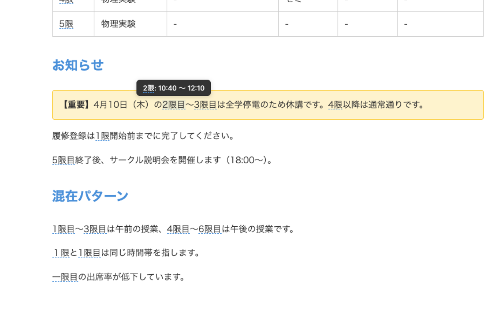
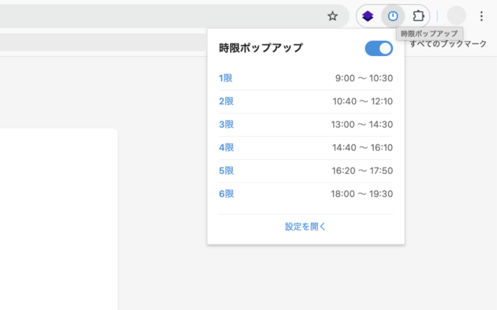
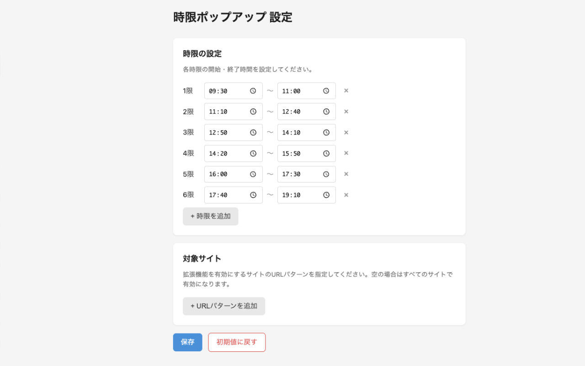

# 時限ポップアップ

学校・大学サイト上の「1限」「2限目」などにホバーすると、対応する開始時刻〜終了時刻をツールチップ表示する Chrome 拡張機能です。

## 主な機能

- 「n限」「n限目」の自動検出
- 半角数字・全角数字・漢数字（一〜十）に対応
- 対応語にホバーすると時限の時間を表示
- オプション画面で時限と時間帯を自由に編集
- 有効化対象 URL の追加・削除
- ポップアップから拡張機能の ON/OFF 切り替え
- 設定は `chrome.storage.sync` で保存

## スクリーンショット







## 動作環境

- Google Chrome（Manifest V3）

## インストール（開発版）

1. このリポジトリをローカルに配置する
2. Chrome で `chrome://extensions` を開く
3. 右上の「デベロッパー モード」を ON にする
4. 「パッケージ化されていない拡張機能を読み込む」をクリック
5. このプロジェクトのルートフォルダを選択する

## 使い方

1. 拡張機能アイコンを押し、ON/OFF を切り替える
2. 学校サイト上の「1限」「2限目」などにマウスを乗せる
3. ツールチップで時間帯（例: `1限: 09:00 〜 10:30`）を確認する
4. 「設定を開く」から時限設定と対象 URL を編集する

## 設定項目

### 時限設定

- 各時限ごとに開始時刻・終了時刻を設定可能
- 行の追加・削除に対応

### 対象 URL

- URL パターンを複数登録可能
- 文字列が正規表現として解釈できる場合は正規表現で判定
- 正規表現として無効な場合は部分一致で判定
- 空配列の場合は全 URL を対象として動作

## デフォルト時限

| 時限 | 開始 | 終了 |
| --- | --- | --- |
| 1限 | 09:00 | 10:30 |
| 2限 | 10:40 | 12:10 |
| 3限 | 13:00 | 14:30 |
| 4限 | 14:40 | 16:10 |
| 5限 | 16:20 | 17:50 |
| 6限 | 18:00 | 19:30 |

## プロジェクト構成

```text
time-popup/
├── manifest.json
├── src/
│   ├── background/
│   │   └── service-worker.js
│   ├── content/
│   │   ├── content-script.js
│   │   └── content-style.css
│   ├── popup/
│   │   ├── popup.html
│   │   ├── popup.js
│   │   └── popup.css
│   └── options/
│       ├── options.html
│       ├── options.js
│       └── options.css
├── debug/
│   └── index.html
├── docs/
│   ├── design.md
│   └── spec.md
├── icons/
├── images/
└── dist/
```

## デバッグ

- `debug/index.html` は検出パターンの動作確認用ページです

## 制約

- `iframe` 内のテキストは対象外
- `input` / `textarea` / `script` / `style` 内のテキストは対象外

## ドキュメント

- 仕様: [docs/spec.md](docs/spec.md)
- UI 設計: [docs/design.md](docs/design.md)
